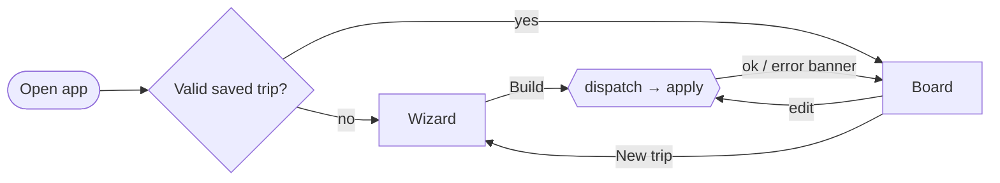

# Architecture — 3 Days in Italy

A static Angular app that builds and edits a 3-day Italy plan from a fixed set of places, keeping times, travel
and opening hours honest.

- **Stack:** Angular 22 (standalone, signals, zoneless), Tailwind 4, Vitest 5, TypeScript 6, Vercel.
- **Code detail:** [`specs/app-spec.md`](specs/app-spec.md).
- **Data:** [`pipeline-architecture.md`](pipeline-architecture.md).

---

## 1. Scope

- **In:** a wizard builds a plan; a board edits it (add, remove, reorder, move between days, refill, undo).
- **Out:** accounts, a backend, bookings, live routing, hotels, AI at runtime.
- **Later:** an agent using the same commands (§8).



## 2. Principles

1. **Plain TypeScript domain.** All planning logic is in `domain/`: no Angular, DOM or I/O. Tested in Node.
2. **Commands only.** The wizard, planner and UI all change the trip by dispatching `Command`s to a pure `apply`.
3. **Store decisions, derive the rest.** The trip stores cities and ordered place IDs. Times, travel and issues
   are recomputed on every change.
4. **Problems are data.** Coded issues warn instead of blocking; fixing one is just another edit.
5. **Deterministic.** No clock, randomness or generated IDs in `domain/`. Ties break by place ID.
6. **Data is the source of truth.** Unknown stays unknown, availability is read cautiously, original text is shown.

## 3. Overview

```
BUILD TIME                               RUN TIME (browser, static SPA)
data/italy.json                          TripStore ── dispatch(cmds) ──► domain/apply
  ▼ pipeline/ (AI + checks)              trip (signal) ──► days = scheduleTrip(trip)
data/places.json (committed) ──import──► components render days · trip saved to localStorage
```

- `domain/`: model · hours · hubs · travel · schedule · commands · planner
- `src/app/`: store · catalog · components. The domain is imported through `@domain/*`.

## 4. Domain

- **Trip:** start date, prefs (interests, avoid, budget, pace, day trips) and a `{ hub, stops }` per day. Each
  place appears at most once.
- **Cities:**
  - 5 hubs, one per region: Rome, Florence, Bologna, Milan, Venice.
  - A day starts and ends at its hub's station and only holds places from that region.
  - A place outside the hub city is a day trip.
  - Changing city costs a morning train: 30 min + a fixed train time.
- **Travel:** no routing API. Straight-line distance × 1.3 → walk (≤ 2 km), transit (≤ 20 km), regional train/bus.
- **Hours:**
  - `hoursOn(place, date)` is the only reader. It returns open intervals, closed (with a reason) or unknown.
  - Weekdays come from UTC dates, so they're right in every timezone.
- **Schedule:** simulates each day in the user's order, never reordering.
  - A stop waits for opening time, its meal window (restaurants: lunch 12–15, dinner 19–22) or its `bestTime`.
  - The day ends with the leg back to the station, due by 22:30.
  - Pace:

    | Pace | Starts | Buffer | Sights/day (planner) |
    |---|---|---|---|
    | relaxed | 10:00 | 30 min | 3 |
    | balanced | 09:00 | 15 min | 4 |
    | packed | 08:30 | 0 | 6 |

- **Issues:**
  - Errors: `CLOSED`, `CLOSES_DURING_VISIT`.
  - Warnings: `DAY_OVERRUN`, `HOURS_UNKNOWN`, `AFTER_BEST_TIME`.
  - Info: `LONG_WAIT`, `NO_MEAL`.
  - Data flags and booking show as badges, not issues.
- **Commands:**
  - `newTrip` · `setStartDate` · `setHub` · `addStop` · `moveStop` · `removeStop` · `fill` · `clearDay`.
  - A batch is all-or-nothing. Bad edits (wrong region, duplicate, bad index) return a short error.
- **Planner:**
  - **Eligible:** same region (and hub city unless day trips are on), not planned, not closed that date. Also no
    `check-*` or `not-interpreted` flag, a rating ≥ 3.5 or none, no avoided tag, and within budget.
  - **`score`:** interests + rating. It only ranks the browser.
  - **`bestInsertion`:** tries every position. Cost = errors ≫ travel + waiting + overrun + lateness for
    `bestTime`.
  - **`fill`:** up to 2 restaurants, then sights up to the pace limit. A place is added only if it brings no new
    error and the day still ends by 22:30. Days take turns, so a small city spreads across all its days.

## 5. Frontend

- **State:**
  - `TripStore` holds the trip as signals, with snapshot undo/redo (last 50), localStorage autosave and an error
    banner.
  - There's no NgRx: `apply` is the reducer. View state lives in the components.
- **Wizard:**
  - Steps: (1) date, pace, budget · (2) tags to like and avoid · (3) a city per day and day trips.
  - Match counts per city, with the best one preselected.
  - A live preview runs the real build and warns when a city runs out of places.
  - It always starts from the defaults. Building is one undo step.
- **Board:**
  - Header: date, route, undo/redo, New trip.
  - Place browser: search, filters, add by button or drag.
  - Day panel: one day at a time, with tabs and an Overview tab.
  - Map: the selected day, or the whole trip.
  - Stop cards: leg, times, badges, issues, and a menu (move, remove, details).
- **Drag and drop:** Angular CDK. A pure `dropToCommand` maps a drop to `addStop` or `moveStop`. The card menu
  covers keyboard and touch.
- **Map:** Leaflet, lazy-loaded. CARTO tiles with `CARTO_KEY`, else OpenStreetMap. One colour per day.
- **Messy data:** flag badges. The place dialog shows the interpreted hours next to the original text.

## 6. Testing and deploy

- **Domain (Vitest, Node, several timezones):**
  - Hours, travel, scheduling, every issue code, every command.
  - A property test builds every hub × pace × 2 dates and checks for no errors, no duplicates, the limits, and
    the same result twice.
- **App (Angular Vitest runner):** the store, `dropToCommand`, the place dialog, the wizard → board flows.
- **Pipeline:** see [`pipeline-architecture.md`](pipeline-architecture.md) §6.
- **Build:**
  - `prebuild` and `prestart` run the pipeline, which is skipped when the data is unchanged.
  - Optional `CARTO_KEY` from the environment or `.env`.
  - Node 24. Vercel serves `dist/italy-planner/browser`.

## 7. Key decisions

| Decision | Instead of | Why |
|---|---|---|
| Framework-free domain | Angular services | Testable in Node; reusable by an agent |
| Commands + snapshot undo | Mutation, NgRx | One mutation path; undo for free |
| Derived times | Stored times | Nothing to sync; a drag only reorders |
| One hub per day | Free city hopping | How short trips work; easy to explain |
| User picks cities, with match counts | Auto city choice | User in control; one planner |
| Score + best insertion, days take turns | Templates, solver, LLM | One rule for build, fill and add; deterministic |
| Meal and best-time windows | Fixed slots | Right time of day without inventing hours |
| Report missing meals | Repeat restaurants | Data is the source of truth |
| Sights limit per pace; every day ends 22:30 | Fill until the day ends | Filling to the end gave 7–11 stops/day |
| Avoid and budget filter the planner | Score penalties | Penalised places still got planned |
| Static JSON, Leaflet, no backend | Fetch, database, paid maps | Synchronous, free, nothing to run |

## 8. Later

- **Agent:** a serverless function on the same `domain/` and `places.json`.
  - Read tools: search, hours, schedule. Write tools: the commands.
  - One agent turn is one undo step.
  - Needs command schemas and a rule against removing the user's stops.
- **Other ideas:** share link, pinned times, duration overrides, travel times read from the descriptions.
