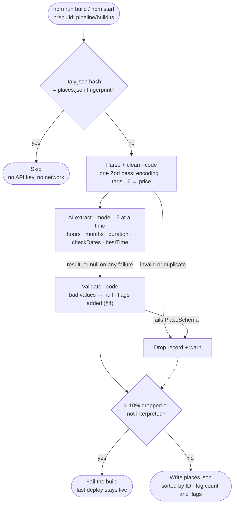

# Data Pipeline — Architecture

Turns raw `data/italy.json` into clean `data/places.json`, the only data the app reads.

- **Code detail:** [`specs/pipeline-spec.md`](specs/pipeline-spec.md).
- **App:** [`app-architecture.md`](app-architecture.md).

---

## 1. Principles

1. **Keep the mess in one place.** The app never parses or repairs data.
2. **One schema.** `PlaceSchema` checks the output and types the app.
3. **Code for mechanics, the model for text:** hours, seasons, visit length, best time.
4. **Unknown is valid.** Not stated → `null`. Nothing invented.
5. **Every problem has an automatic consequence.** A bad record costs only itself. A systemic failure fails the
   build, so the last deploy stays live.
6. **Unattended.** It runs in the build with no human step. About 300 lines plus one prompt.

## 2. Flow

## 3. Output

| Field | From | Notes |
|---|---|---|
| `id`, `name`, `type`, `city`, `region`, `neighborhood`, `description`, `rating`, `bookingRequired` | given | Encoding repaired. A rating outside 0–5 → `null` |
| `lat`, `lng` | given | Kept. Far off → `check-location` |
| `tags` | code | Lower-case, `_` → `-`, de-duplicated |
| `priceLevel` | code | Count of `€`, else `null` |
| `hours` | model | Per weekday `[{ open, close }]` (`HH:MM`). `[]` closed, `null` not stated. Closes after midnight allowed |
| `openMonths` | model | All 12 unless a closure is stated. `null` = unknown |
| `durationMin` | given → model → default | The field, else the text, else a default for the type |
| `bestTime` | model | `morning` · `afternoon` · `evening` · `night` · `null`. Never changes `hours` |
| `flags` | code | `check-dates` · `check-location` · `duration-estimated` · `not-interpreted` |
| `source` | given | The original hours and seasonal notes, shown in the app |

## 4. Rules

- **Contradictions about availability:** the more restrictive reading wins. If it can't be expressed →
  `check-dates`. Example: Brera market, "third weekend only".
- **Other contradictions:** the explicit field wins. The text only fills a missing duration.
- **No times in the raw hours** (`null`, "Evenings"): every day stays `null`. A named time of day → `bestTime`.
- **Advice closes nothing.** "Best in spring" and "go at 7am" don't count. Only a stated closure of the place
  itself does; Appian Way's "closed to cars" doesn't.
- **Exceptions stay in the original text,** e.g. the Vatican's last-Sunday opening.

| Check | Consequence |
|---|---|
| The model failed, or no valid hours came back from times that were there | `not-interpreted`; hours and months unknown |
| An invalid time, or a close before the open (except after-midnight closes up to 06:00) | That day → `null` |
| A month outside 1–12 | `openMonths` → `null` |
| Duration missing or outside 5–720 min | Type default + `duration-estimated` |
| Outside Italy, or > 50 km from the city's median point | `check-location` |
| Fails `PlaceSchema` | Record dropped |

- **In the app:** flagged `check-*` and `not-interpreted` places are never auto-planned, but can be added by hand.
- **Today's data:** 103 places. 8 have an estimated duration, 2 need dates checked, 1 needs its location checked
  (Brera, whose longitude looks like a typo).

## 5. Model step

- **One request per record, no tools.** The record goes in `<record>` tags, as data, not instructions.
- **Structured output:** `messages.parse` + a Zod schema, on `claude-sonnet-5-5` at `low` effort.
- **The schema is loose on purpose.** Formats and ranges are checked in code, so each problem gets its own
  consequence.
- **Prompt (`pipeline/prompt.md`):** the field rules, the rules in §4, and 3 synthetic examples.
- **Any failure** (refusal, truncation, bad output, network) → `not-interpreted`. No credentials → every record
  fails → the 10% check fails the build.

## 6. Build and quality

- **Fingerprint:**
  - A SHA-256 of `italy.json` is stored in `places.json`. Same hash → skip.
  - After changing the prompt, model or code: delete `places.json`.
- **Credentials:** `ANTHROPIC_API_KEY` or an `ant auth login` profile. Only needed when the data changes. Commit
  the result so Vercel builds skip the model.
- **Unit tests (offline):** encoding repair, record parsing, every validation consequence.
- **Golden set:**
  - About 20 tricky real and synthetic records, checked for hours, closed days, months, flags and best time.
  - It calls the model and isn't part of the build. Run it after changing the prompt or model.
- **Commands:**
  - `npm run data`: run the pipeline.
  - `npm run data:eval`: run the golden set.
  - `npm run build` / `npm start`: run the pipeline first.

## 7. Not done, on purpose

- **No human step:** no corrections file, no review gate.
- **No hours grammar or rule engine.** Rare patterns stay in the original text.
- **No facts from the model** beyond the record: no coordinates, no ratings.
- **No per-record cache.** Any data change re-runs every record (1–2 min, a few cents).
- **No field-rename map or atomic write.** A format change or a half-written file fails the build loudly.

**Later:** a per-record cache, a CI job that regenerates `places.json`, the golden set as a build gate, geocoding
for flagged coordinates, and a queue-based ingestion service once there's a backend.
